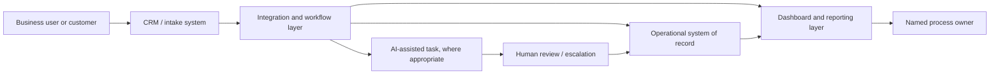

# Capability Map

This map separates what CompanyConnect.Tech can show safely in public from capabilities that may be delivered privately but do not yet have public GitHub evidence. It is designed to keep sales conversations credible: **evidence is stronger than a long technology list.**

| Capability | Client-safe public evidence | What a prospective buyer can safely conclude | Evidence status |
| --- | --- | --- | --- |
| CRM and revenue operations | [Operations Blueprint](https://github.com/Lloyd-Lew/companyconnect-operations-blueprint), [Runnable Lead-to-Quote Automation Demonstrator](https://github.com/Lloyd-Lew/lead-to-quote-automation-demo), lead-to-quote delivery pattern, problem map, package routes | We design CRM ownership, handoffs, pipeline visibility, quote, and follow-up systems around business outcomes. | Demonstrated with runnable lifecycle and API evidence |
| Workflow automation | [Operations Blueprint](https://github.com/Lloyd-Lew/companyconnect-operations-blueprint), implementation process, workflow delivery patterns, sales-team guide | We design practical automation with ownership, exception paths, idempotency, review, retry-aware handoffs, and measurement. | Demonstrated with runnable lifecycle evidence |
| Integrations and data movement | [Operations Blueprint architecture](https://github.com/Lloyd-Lew/companyconnect-operations-blueprint/blob/main/docs/architecture.md), quote-to-cash and connected-operations patterns | We connect systems through explicit adapter boundaries where disconnected data creates re-entry, delay, or poor visibility. | Demonstrated at reference-architecture level |
| Dashboards and reporting | [Operations Blueprint KPI route](https://github.com/Lloyd-Lew/companyconnect-operations-blueprint), reporting delivery pattern, measurement framework | We build leadership-ready operational visibility around the measures that matter. | Demonstrated with synthetic KPI evidence |
| AI-enabled operations | AI document and knowledge workflow pattern, safeguard guidance, [Operations Blueprint operational boundaries](https://github.com/Lloyd-Lew/companyconnect-operations-blueprint/blob/main/docs/operational-boundaries.md) | We apply AI to bounded operational work with human review, escalation, data boundaries, and accountable ownership. | Demonstrated at reference-architecture level; live model evidence remains use-case-specific |
| monday.com and Make-based operations | Public portfolio scope and working-method documentation | We work with practical business-operation platforms and integration patterns. | Demonstrated at portfolio level |
| Backend applications and internal automation services | [Operations Blueprint](https://github.com/Lloyd-Lew/companyconnect-operations-blueprint) and [Lead-to-Quote Automation Demonstrator](https://github.com/Lloyd-Lew/lead-to-quote-automation-demo) with source, architecture, API tests, CI, security controls, SBOM, and release | We can demonstrate maintainable TypeScript API services and an end-to-end lifecycle reference for client-safe operational workflows. | Demonstrated |
| AI agents and multi-agent systems | No public source repository or runnable demonstrator in this account | A public technical showcase is not yet available through GitHub. | Evidence required |
| WordPress or custom web development | No public source repository or client-safe code showcase in this account | A public technical showcase is not yet available through GitHub. | Evidence required |
| DevOps, payments, mobile, or enterprise infrastructure | No public source repository or independently inspectable artefact in this account | Do not claim GitHub proof for these areas until evidence exists. | Evidence required |

## Reference system architecture

This is a client-safe reference pattern, not a diagram of a customer environment. It explains the level of operational design represented by the portfolio.

## How to use this map in a sales conversation

Start with the business problem and point to the matching demonstrated capability. If the requested outcome falls under “evidence required,” do not overstate what the public portfolio proves. Instead, identify whether a client-safe demonstrator, technical discovery, or reference conversation is appropriate.

> The public portfolio is a proof layer, not a full inventory of private client work or a promise that every technology request is already productized.
