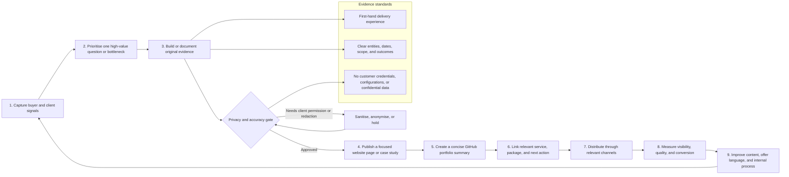

# CompanyConnect Growth Loop: Sales, SEO, AEO, and GitHub

This operating loop turns real delivery work into client-safe proof, clear answers to buyer questions, and measurable improvements to CompanyConnect.Tech and its GitHub presence. The goal is not to publish content for its own sake. The goal is to make the next high-value buyer question easier to discover, understand, trust, and act on.

## The loop in practice

| Stage | Owner action | Output | Quality question |
| --- | --- | --- | --- |
| **1. Capture** | Record recurring discovery-call questions, objections, outcomes, failed handoffs, and useful client language | A weekly insight list | What do qualified buyers repeatedly need help understanding? |
| **2. Prioritise** | Score each idea by buyer intent, commercial relevance, proof available, and delivery relevance | One priority topic per cycle | Does this topic help a real prospect decide or act? |
| **3. Evidence** | Gather anonymised workflow context, before-and-after process, scope, safeguards, and measured outcome where permitted | Evidence brief | Is the content based on direct experience and independently understandable? |
| **4. Privacy and accuracy gate** | Confirm client permission, remove identifiers, verify claims, and exclude credentials or screenshots with sensitive data | Approved source material | Would we be comfortable showing this to the client and a future buyer? |
| **5. Publish** | Create or improve one focused website page, case study, FAQ, service section, or guide | Canonical website page | Does the page answer one primary question near the top, with a clear next step? |
| **6. GitHub proof** | Add a concise client-safe portfolio summary or update the relevant README | Public proof asset | Does this demonstrate delivery capability without revealing client operations? |
| **7. Conversion path** | Link the content to the matching package, audit, service page, or strategy call | Deliberate CTA path | Is the recommended next action proportionate to the buyer’s certainty? |
| **8. Measure** | Review search, answer-engine, referral, and lead signals | Monthly scorecard | Did qualified visibility or action improve? |
| **9. Improve** | Refresh titles, introductions, facts, examples, internal links, CTA language, and delivery documentation | Next-cycle backlog | What evidence or clarity gap prevented stronger performance? |

## Publishing standards for SEO and answer-engine visibility

Google recommends helpful, reliable, people-first content that demonstrates expertise, trust, and clear authorship; Bing states that clear, focused, independently understandable content with explicit facts and well-defined entities supports grounding and citation eligibility in AI experiences. [1] [2] This creates a straightforward editorial rule for CompanyConnect.Tech:

> **Every published page should answer one real buyer question with original, accurate, client-safe evidence, clear terminology, and a relevant next action.**

A practical page structure is:

1. A descriptive title that says what the page helps the reader do.
2. A direct answer or definition in the opening section.
3. Context, scope, and who the service is for.
4. A first-hand delivery approach, examples, safeguards, and limitations.
5. A relevant FAQ that answers the questions a buyer asks before booking.
6. A clear, single next action linked to the right package or diagnostic.

Structured data should only reflect content that is visible and accurate on the page. Google recommends JSON-LD as a maintainable implementation format and advises testing markup after deployment. [3]

## Cadence and scorecard

| Cadence | Activity | Primary measures | Decision made |
| --- | --- | --- | --- |
| **Weekly — 20 minutes** | Capture questions, proof, objections, and content opportunities from delivery and sales conversations | New buyer questions, evidence assets available, privacy approvals | Select or refine the next topic |
| **Monthly — 60 minutes** | Publish or refresh one high-intent proof asset and review the profile/portfolio | Qualified referrals, service-page engagement, strategy-call leads, GitHub portfolio views, content gaps | Improve the CTA, page, package fit, or supporting proof |
| **Quarterly — 90 minutes** | Audit all public business-facing GitHub and core website service content | Accuracy, freshness, entity consistency, privacy, links, metadata, case-study coverage | Archive outdated material; refresh, consolidate, or create the next asset |
| **After each completed project** | Conduct a delivery close-out and permission review | Outcomes captured, client quote/permission status, reusable pattern identified | Create a case study, anonymised system pattern, or internal-only lesson |

## Content and offer priorities

The best first topics are the pages most closely connected to CompanyConnect.Tech’s existing services and purchase decisions. They should be based on delivery knowledge, not broad keyword chasing.

| Priority topic | Buyer question to answer | Best content form | Commercial path |
| --- | --- | --- | --- |
| CRM health and lead follow-up | “Why are we losing leads after they enquire?” | CRM audit checklist or case study | AI Business Audit → Foundation CRM |
| Quoting, invoicing, and handoff automation | “How can we stop re-entering data between sales and operations?” | System-pattern guide | Foundation CRM or Revenue & Operations System |
| monday.com operating system | “How should a service business structure monday.com across sales and delivery?” | Implementation guide with FAQ | Foundation CRM or Revenue & Operations System |
| AI document and knowledge workflows | “Where is AI safe and useful in our operations?” | Use-case guide with safeguards | AI Business Audit → AI-Enabled Operations |
| Post-launch system stewardship | “Who maintains workflows when the team or tools change?” | Optimisation guide | Ongoing Optimisation |

## Public GitHub governance

The public GitHub account should remain a **curated trust and proof layer**, not a client-file archive. The following rules preserve its value.

| Rule | Standard |
| --- | --- |
| **Public repository purpose** | Every public repository needs a clear visitor purpose, descriptive name, useful README, homepage, relevant topics, and client-safe content |
| **Client material** | Keep client-specific exports, credentials, names, internal assets, live links, and workflow configurations private unless written permission and safe sanitisation are complete |
| **Portfolio updates** | Add only anonymised delivery patterns, approved outcomes, and reusable business insights—not raw project exports |
| **Profile quality** | Keep the bio, company, location, website, links, pinned work, service language, and call to action aligned with the live company website |
| **Package discipline** | Retain the existing audit → focused build → system build → AI transformation → optimisation ladder; improve explanations before creating more packages |
| **Annual review** | Reconfirm every claim, link, platform, testimonial, package range, and public repository purpose at least once per year |

## Measurement note

Do not treat SEO or AEO as guaranteed rankings, citations, or traffic. Both depend on crawlers and platforms outside CompanyConnect.Tech’s control. Measure the quality of the assets, discoverability, qualified visibility, and business actions over time; use those signals to improve the loop rather than chasing isolated vanity metrics. [2]

## References

[1]: https://developers.google.com/search/docs/fundamentals/creating-helpful-content "Google Search Central — Creating helpful, reliable, people-first content"
[2]: https://www.bing.com/webmasters/help/webmaster-guidelines-30fba23a "Bing Webmaster Guidelines"
[3]: https://developers.google.com/search/docs/appearance/structured-data/intro-structured-data "Google Search Central — Introduction to structured data markup"
